<div align="center">


# Gimbal 🖲

**A webcam dose meter that proves you actually did your prescribed vestibular rehab at therapeutic velocity.**

*No LLM. No server. No account. No upload path. On purpose.*



**[https://gimbal.edycu.dev](https://gimbal.edycu.dev)** · [Demo walkthrough](DEMO.md) · [Methods](METHODS.md) · [Limitations](LIMITATIONS.md)

*This repository is **public**, and so is the hosted application at the address
above. Nothing here is gated.*

*There are no badges on this page, deliberately. Its central claim is that
nothing here reaches a third-party origin, and opening with four images fetched
from a badge CDN would argue against everything below it. The numbers are
greppable instead — start with `package.json`.*

</div>

---

Six weeks after the collision, Maya still cannot turn her head to check a blind
spot without the room sliding sideways — and the exercise that would fix that is
a folded paper handout she has been doing at half speed, every day, for nothing.

*(Maya is a composite of the patient this is built for, not a real named
individual. No testimonial, quote, or record in this project is attributed to a
real person.)*

## 💡 The problem, in three sentences

Gaze-stabilization exercise is prescribed with **parameters** — head frequency,
duration, repetitions per day — exactly like a drug. The clinic measures none of
them at home; the only instrument is the question *"how did the home exercises
go?"*, answered from memory, in minutes-claimed. **Every tool in this space
watches, asks, or chats. Nothing measures the delivered dose of the prescribed
treatment.**

## 🎯 What Gimbal does

It turns a laptop webcam into a **dosimeter for a prescribed exercise**. It does
not decide the therapy. It measures whether the therapy was delivered.

| Stage | What happens |
|---|---|
| **Prescription in** | The patient types their clinician's parameters into a protocol card. Eight required numeric fields, **no presets and no second source of numbers.** Gimbal has no path to originate a prescription: `/app?blank` is the empty card the product ships, the one set of values that can ever arrive pre-filled comes from `src/protocol/exampleParameters.ts` by a labelled route, and **nothing in this repository can tick the clinician-attestation checkbox for you.** |
| **Measure** | `FaceLandmarker` at ~30 Hz → yaw in degrees on the camera's own frame clock → central-difference angular velocity → cycle segmentation → bias-corrected peak \|ω\| per cycle |
| **Coach, eyes-free** | A Web Audio click train sets tempo; one oscillator's pitch bends continuously as peak velocity leaves the prescribed band |
| **Verify gaze without measuring gaze** | A Landolt C re-randomises every 2.5–5.0 s; the patient answers its gap orientation with an arrow key, during motion |
| **Refuse** | Five named refusals — `too-slow`, `too-fast`, `off-cadence`, `low-confidence`, `face-lost` — each **credited zero** and painted as a gap with the reason in words. `npm run bench` drives all five plus `ok` end-to-end, and the labelled illustration on `/` steps through the same six from the same drives |
| **Gate** | A 0–10 symptom rating at every block boundary runs a pure stop-rule function against the session's own baseline |
| **Report out** | One printable page: delivered vs prescribed per block, refusal histogram, gaze tally, symptom entries, a "Why?" citation on every criterion |

**The product is the refusal.** A dose meter that credits everything is a
stopwatch.

## 🏗️ Architecture, in one paragraph

<div align="center">

<picture>
  <source media="(prefers-color-scheme: dark)" srcset="docs/assets/architecture-dark.svg">
  <source media="(prefers-color-scheme: light)" srcset="docs/assets/architecture-light.svg">
  
</picture>

</div>

*Two files rather than one, because an `` renders an SVG as an isolated
document behind GitHub's caching proxy, where a `prefers-color-scheme` block
inside the file cannot be relied on. `<picture>` is the mechanism GitHub actually
supports. Both are generated from one source, so the geometry cannot drift
between them.*

One 30 Hz measurement loop, six screens, and one printable page, running entirely
inside a browser tab with **one runtime dependency and zero network requests
after page load**. There is no backend because a backend would falsify the
product's central safety claim. There is no LLM because the output is a *count*,
and a count has no use for a generative model — while an LLM would import the
entire hallucination surface into a submission judged on safety. There is no
framework because the only code path being judged is a hot loop, and a re-render
model is a hazard inside it.

```
src/
├─ capture/   camera.ts · landmarker.ts · pose.ts
├─ dsp/       ring · smooth · velocity · fft · segment · quality · score · limits · stream
├─ audio/     scheduler.ts
├─ optotype/  landoltC.ts · trials.ts
├─ protocol/  card.ts · stopRule.ts
├─ session/   blockRunner.ts · dose.ts
├─ store/     local · session · ledger · deviceSignature · exampleLedger · export
├─ report/    report.ts · limitations.ts
├─ styles/    tokens · themes · fonts · screen · landing · print
├─ landing/   main.ts · replay.ts · trace.ts · figures.ts   (the page at /)
└─ ui/        screens/* · dial · strip · sparkline · live · copy · dom
```

Two HTML entry points and no router in either: `index.html` is the landing page,
`app/index.html` is the six-screen instrument. They share every stylesheet, and
the landing page's hero replay imports the real `Dial`, the real `scoreCycle`
and the real refusal copy rather than redrawing them — so the picture on `/`
cannot drift away from the product on `/app`.

One typeface is vendored: a Latin subset of **Inter 4.1** (SIL OFL 1.1,
73.9 kB, both variable axes intact), served same-origin from `/fonts/` with its
licence beside it. `font-src 'self'` means a font CDN would be blocked by the
browser rather than merely disallowed by policy, so a vendored copy is the only
kind of web font this project can have. Attribution and the exact subset are in
`NOTICE.md`.

**Dependencies: 1 runtime (`@mediapipe/tasks-vision`), 6 dev — `vite`,
`typescript`, `vitest`, `@playwright/test`, plus `@vitest/coverage-v8` and
`jsdom`, which are the coverage reporter and the DOM the unit tests run
against.** Greppable in `package.json`, which is how you check it, and asserted
on every push by Stage 2 of `check.yml` so the number here cannot drift from the
number there again. `npm audit` reports zero vulnerabilities.

**The runtime count is the one that matters**, and it is 1. Nothing in the dev
list reaches a user: the shipped bundle is greppable too, and `U-DIST` reads it
on every build.

The MediaPipe WASM runtime and the `face_landmarker` model bundle are **vendored
same-origin** under `/model/`, content-addressed, and committed. Nothing is
fetched from a CDN — which is what makes the DevTools-Network privacy proof
honest rather than a stunt. The bundle is single-threaded WASM, so no COOP/COEP
cross-origin isolation is required and the app runs from a plain static host.

`METHODS.md` has the full derivations: the bias correction, the sampling floor,
the tracking-quality score, and where each stops being trustworthy.

## 🚀 Try it in about a minute

Open **[gimbal.edycu.dev](https://gimbal.edycu.dev)** — nothing to install.

`/` explains the instrument. **`/app`** is the instrument.

| Route | What you get |
|---|---|
| **`/app`** | the eight numbers below, already typed in and labelled as an example |
| **`/app?demo`** | the same thing, named — the address `DEMO.md` publishes |
| **`/app?blank`** | the eight empty fields: the origination path the product ships |

`/app` arrives pre-filled so that a reader with no clinician's handout in front
of them can reach the measurement, and it labels itself the whole way: a
persistent banner above the form, an `EXAMPLE` chip on every one of the eight
values, and `EXAMPLE …` as the source string that prints in the report's "Why?"
disclosure and therefore travels onto paper. A visible link beside that banner
goes straight to the blank card.

**It does not tick the clinician-attestation checkbox for you.** Filling in a
number is a convenience; ticking someone's attestation on their behalf is not,
and it is the tick — not the numbers — that lets a card exist at all. Nothing
downstream of that box exists until a human presses it. Check `U-CARD` and both
a unit test and an e2e assertion hold that, and hold `/app?blank` empty.

Or run it locally:

```bash
npm ci
npm run dev
```

Either way:

1. Tick the box confirming a clinician prescribed the exercise.
2. Type the eight numbers below.
3. Choose a stage.
4. Allow the camera and let the 10-second light-and-frame-rate check run.
5. Start, and turn your head from side to side.

**Turn your head lazily and watch the counter refuse you by name inside thirty
seconds.** That is the whole product in one gesture.

### The eight numbers, for evaluation only

These are **numbers a clinician would have written**, supplied here so you have
something to type. They are **not a recommendation.** They are the only eight
numbers anywhere in the application: there is no preset list, no "typical values"
control and no second source, so a filled card can only ever have arrived through
the one labelled route that announces itself as an example everywhere it appears
— and that route still cannot complete the clinician gate.

That last clause is what makes "Gimbal cannot originate a prescription" a
structural property rather than a claim, and it is where the property now lives:
`/app?blank` still renders the eight empty fields, and no code in this repository
is allowed to tick the attestation. Check `U-CARD` asserts both, asserts that
this table and `src/protocol/exampleParameters.ts` carry the same eight values,
and asserts that the visible route back to the blank card is still on screen.

| Field | Value |
|---|---|
| Frequency band, low | `1.7` Hz |
| Frequency band, high | `2.3` Hz |
| Peak velocity floor | `150` °/s |
| Peak velocity ceiling | `350` °/s |
| Block length | `60` sec |
| Blocks | `1` |
| Stop rule: rise over baseline | `3` points |
| Stop rule: absolute ceiling | `7` points |

*Block length 60 and one block make the evaluation run a minute rather than six.
Both are card fields, so choosing them is exactly the act the product is built
around.*

**No flags. No environment variables. No keys. No account.** The judged
capability executes for real on the default path, or it does not execute at all.

## 📊 Verify the engineering

```bash
npm ci
npm test            # 1062 tests against analytic ground truth + 8 mechanical source checks
npm run bench       # all six gate outcomes end-to-end, then the frame-budget timings
npm run check:build # builds the production bundle, then greps it
```

`npm test` runs **1062** automated tests plus eight mechanical source checks. Four
more checks — `U-DIST`, `U-CFG`, `U-DOC`, `U-DEP` — read a build artifact or a
deployed URL and therefore live in `check:build` and `check:deploy` instead, for
**twelve** in total. The split is a rule rather than a convenience: a check that
passes vacuously on a clean clone is worse than no check, because it is a green
tick standing in for evidence.

### Which commands run with the network unplugged

A project whose headline number is *zero requests* should not be vague about the
one place its own tooling reaches out. It is one place, and here it is.

| Command | Air-gapped? | Why |
|---|---|---|
| `npm test` | **yes, always** | Every file it reads is committed in this repo. That partition rule is stated at the top of `scripts/checks.mjs` and is why four checks live elsewhere. |
| `npm run bench` | **yes, always** | Reads one committed card JSON, imports `src/`, writes to stdout. No `fetch`, no fixture, no camera. |
| `npm run check:build` | **yes, always** | Builds locally, then greps the output. |
| `npm run verify` | **after the first run on a machine** | The R11 gate runs its assertions in Chromium. If no Chromium build is present it downloads one — the **only** network request anywhere in this suite, once per machine — and what it fetches is a *test harness*, never anything the application runs on. Every later run makes no request, and the script prints which of the two cases it took. |
| `npx playwright test` | **after the first run on a machine** | Same browser, same reason. |

That boundary is stated in the header of `scripts/verify.mjs` rather than left
for someone to discover on a plane. A browser is a test harness, not application
code — but it is still a network request in a repository whose headline number is
zero, so it is named rather than left technically-true-by-omission.

### The benchmark drives all six gate outcomes — no camera, no fixture

The gate has six outcomes: `ok`, and the five refusals `too-slow`, `too-fast`,
`off-cadence`, `low-confidence`, `face-lost`. The benchmark drives **each one
end-to-end** from an analytic yaw signal, through the *shipped* modules imported
from `src/` — `VelocityStream` → `frameQuality` → `CycleSegmenter` →
`scoreCycle` — and asserts every result **before it prints a single timing**.

| Outcome | Drive | Analytic peak \|ω\| | Cycles | Credited | Delivered dose |
|---|---|---|---|---|---|
| `ok` | ±20° at 2.0 Hz | 251.3 °/s, inside `[150, 350]` | 119 of 120 | **119** | 59.506 s |
| `too-slow` | ±8° at 2.0 Hz | 100.5 °/s, below the floor | 119 of 120 | **0** | **0.000 s** |
| `too-fast` | ±30° at 2.0 Hz | 377.0 °/s, above the ceiling | 119 of 120 | **0** | **0.000 s** |
| `off-cadence` | ±30° at 1.2 Hz | 226.2 °/s, *inside* the window | 71 of 72 | **0** | **0.000 s** |
| `low-confidence` | ±20° at 2.0 Hz, degraded fit | 251.3 °/s, inside the window | 119 of 120 | **0** | **0.000 s** |
| `face-lost` | ±20° at 2.0 Hz, no face | 251.3 °/s, inside the window | 119 of 120 | **0** | **0.000 s** |

Four things that table is doing:

- **The refusals are not one failure repeated.** `too-slow` is the wrong speed.
  `too-fast` is the *opposite* wrong speed, because faster is not better and the
  card has a ceiling for that reason. `off-cadence` is the *right* speed at the
  wrong tempo — it is last in the reason precedence, so reaching it proves every
  check above it passed. `low-confidence` is a perfectly creditable sweep the
  instrument declines to vouch for.
- **`low-confidence` is the one that carries the argument.** It is the answer to
  the largest technical risk in the project — head-pose fidelity at 2 Hz on a
  commodity webcam — and the answer is that the instrument *refuses to emit
  rather than smoothing*. `too-slow` on its own reads as a bug. `too-slow` and
  `low-confidence` together read as a policy.
- **Every refusal delivers exactly `0.000 s`,** asserted with `===`. Not
  approximately zero. One `refuse()` helper, one code path, five ways in.
- **The sub-therapeutic sweeps are detected and then refused, not lost.**
  100.5 °/s clears the 22.5 °/s hysteresis deadband, so the same 119 cycles are
  segmented at ±8° as at ±20°. That distinction is the difference between a
  policy and a dropout, and it is what a skeptical reader should check first.

The drive constants are derived from the shipped ones rather than restated —
`INSTRUMENT_LIMITS.qFloor` is one of the two `PROVISIONAL_FROM_SPIKE` values, so
a hard-coded `0.55` would silently stop testing anything the day it is
calibrated. The outcome list itself is imported from `src/dsp/types.ts`, and a
seventh outcome added to the gate without a drive for it fails the benchmark.
The `face-lost` drive feeds `facePresent: false` alongside a continuing yaw
series: that exercises the *gate's* handling of an absent face, and the file says
so, because an unstated approximation in a benchmark is how a benchmark starts
lying.

Only then does it report p50/p95/p99 against the 33.33 ms frame budget — the
per-frame path costs **single-digit microseconds at p95, under 0.02 % of the
budget.** The counts are byte-deterministic across machines and the timings are
not, so `DEMO.md` publishes the timings as observed *ranges* with the machine
named, and rests the claim on the four orders of magnitude of headroom rather
than on a spot value nobody else can reproduce.

**That benchmark is a compute-cost measurement.** It is not an accuracy figure
and it is emphatically not the bench validation described under *Status* below,
which has not been recorded.

Highlights of what the unit suite actually claims:

- The hand-written 256-point Hann FFT recovers `sin(2π·2·t)` at 30 fps into the
  bin containing 2.0 Hz, with a bin width of exactly `30/256` = **0.1172 Hz**,
  and returns **no peak** — not `NaN`, not 0 Hz — for an all-zero input.
- A 3-point central difference under-reports peak velocity by exactly
  `1 − sin(2πfT)/(2πfT)` = **2.90 %** at 2 Hz / 30 fps, and the published
  correction is **×1.0299**. The same identity holds at 1.0, 1.5 and 2.5 Hz, and
  a test asserts the correction is applied **once, not twice**.
- `dt` is used **as measured**, never assumed to be 33.3 ms.
- `scoreCycle` reaches all six outcomes, credits boundary equality at both band
  edges, and has deterministic reason precedence. **A test greps the module and
  fails if any numeral other than `0` and `1000` appears in it** — which is how
  "every clinical threshold comes from the card" is checked rather than
  believed. That unit test proves the gate *branches*; the benchmark above
  proves the *pipeline can produce* each of those six cycles from a signal,
  which is the stronger and more useful claim.
- `evaluateStopRule` partitions the whole 0–10 × 0–10 integer grid with no gap
  and no overlap, and the only constant in the function is zero.
- Int16 quantisation at scale 50 round-trips within **0.01 °/s**, half an LSB,
  and a velocity beyond ±655.34 °/s is **refused, never clipped**.

## 🧪 The harness around it

Every gate below runs on every push and every pull request, and again before
anything deploys. **None of it costs a dependency** — that is the constraint the
harness was built under, because "1 runtime, 6 dev, `npm audit` 0
vulnerabilities" is evidence a reviewer verifies in five seconds and boilerplate
is not worth trading it for.

| Layer | What runs | Where |
|---|---|---|
| Types | `tsc --noEmit` over `src/` and `tests/` on every build — `strict`, plus `noUnusedLocals`, `noUnusedParameters`, `noFallthroughCasesInSwitch` and `noUncheckedIndexedAccess` | `npm run build`, `tsconfig.json` |
| Unit | 1062 tests against analytic ground truth | `npm test` → `vitest` |
| Mechanical checks | 12 greps, each closing one documented failure pattern: `U-FLAG` `U-DEV` `U-CARD` `U-LIMITS` `U-SRC` `U-OUTLINE` `U-COUNT` `greppable` in `npm test`; `U-DIST` `U-CFG` `U-DOC` `U-DEP` in the builder commands | `scripts/checks.mjs`, `check-dist.mjs`, `check-deploy.mjs` |
| Behavioural | the six-outcome gate partition, then p50/p95/p99 against the frame budget | `npm run bench` |
| End-to-end | the accessibility, origin, print, measurement and disclosure suites in Chromium | `npx playwright test` |
| R11 gate | model-bundle SHA-256, then the measurement and disclosure assertions on recorded pixels | `npm run verify` |
| CI | `check.yml` on every push and PR; `preview.yml` deploys a per-PR URL and verifies **its headers**, so a weakened CSP is caught on the pull request rather than after it reaches production | `.github/workflows/` |
| Release | version, tag, changelog and deploy, in that order, only after the gates pass — then the **deployed** headers are re-verified | `release.yml`, `RELEASING.md` |
| SAST | CodeQL, `security-and-quality` query pack, weekly as well as per-push | `codeql.yml` |
| Secrets | gitleaks over **full history** (`fetch-depth: 0`) — the mechanical form of "scan the past before going public" | `gitleaks.yml` |
| Supply chain | Dependabot, grouped, monthly, majors ignored; `npm audit` at 0 vulnerabilities | `dependabot.yml` |

**Semantic versioning is automatic and hand-written.** `scripts/version.mjs`
reads the git tags and the Conventional Commits since the last one and decides
the bump, using Node builtins and `git` and **zero dependencies**.
`semantic-release` and its plugin set would have added a dozen. `RELEASING.md`
has the table.

**There is no linter, and that is a decision rather than an omission.** The two
things a linter would be installed for are both already covered:

- **The generic rules.** `tsconfig.json` turns on `strict`, `noUnusedLocals`,
  `noUnusedParameters`, `noFallthroughCasesInSwitch` and
  `noUncheckedIndexedAccess`, and `tsc` runs on every build. Unused bindings,
  fall-through switches and unchecked index access are the ESLint rules people
  actually cite; the compiler is already failing the build on them.
- **The rules a generic rule set could not know about.** Twelve mechanical
  checks: that no `mock`/`fake`/`simulate`/`stub` survives in `src/`, that no
  focus ring is removed, that the limitations text is byte-identical in five
  places, that every card field carries a source string, that the reproduce
  path takes no flags, that no README image is fetched from another origin, and
  that the test count printed here is the count the suite reports.

**The honest gap, since this section is an argument and arguments should state
their weak point:** `tsconfig.json` covers `src/` and `tests/`. The `e2e/` specs
are TypeScript that Playwright executes but nothing typechecks, because they
import Node builtins and typechecking them would need `@types/node` — a fifth
dev dependency. The trade was made in favour of the greppable count, and it is
recorded here rather than left for a reader to notice.

`.github/CONTRIBUTING.md` states the rules a change has to clear;
`.github/SECURITY.md` states the threat model, which is unusual here because
there is no server to attack — and states which repository settings a maintainer
must switch on, since a workflow file is inert until they are.

## 📚 Grounded — and a boundary list longer than the grounding

`METHODS.md` §11 is a reference list, not a gesture at one. **Every entry carries
a DOI or PMID and was opened before it was written**, and every entry says what
the source supports *and what it does not*. Five things it establishes, in the
literature's own words:

- **The problem is real and the treatment is indicated.** The Amsterdam
  consensus statement — *"If dizziness, neck pain and/or headaches persist for
  more than 10 days, cervicovestibular rehabilitation is recommended"*
  (doi:10.1136/bjsports-2023-106898) — and the Living Concussion Guidelines,
  Recommendation 10.5, evidence level A. Schneider et al.'s RCT
  (doi:10.1136/bjsports-2013-093267) cleared 73 % of its treatment arm within
  eight weeks against 7 % of controls, n = 31.
- **This therapy is prescribed as a quantity.** The APTA vestibular CPG
  (doi:10.1097/NPT.0000000000000382) states a home-programme dose in sessions per
  day, minutes per day and weeks — *3–5×/day, at least 20 min/day, for 4–6 weeks*
  for chronic unilateral hypofunction. **On the guideline's own grading that dose
  is weak evidence** — *"based on moderate to weak evidence, clinicians **may**
  prescribe"* — and it is scoped to peripheral vestibular hypofunction, not
  concussion. Both qualifiers travel with it everywhere it appears, here
  included. What it establishes is not that *this* dose is right: it is that a
  dose is **prescribed at all**. A quantity that is prescribed is a quantity that
  can be under-delivered.
- **Not measuring eye movement is the guideline's position, not a shortcut.**
  The strongest objection to Gimbal is that a *gaze*-stabilization tool ought to
  measure gaze. The ANPT's own clinical algorithm answers it at **Level I,
  strong** — and unlike the dose, this one holds up when you check it against the
  parent guideline, where it is **Action Statement 4, evidence quality I,
  recommendation strength strong**: voluntary saccadic or smooth-pursuit eye
  exercises *"should **NOT** be offered in isolation as gaze stabilization
  exercises."* Eye movement without
  head movement is not the exercise; head movement against a held visual target
  is — and that is exactly and only what Gimbal measures. The same algorithm
  names **Dynamic Visual Acuity** and the **Gaze Stabilization Test** as the
  recommended measures on the visual-blurring-with-head-movement branch, which is
  the lane the Landolt C task borrows its shape from.
- **Self-report over-counts what was delivered.** Nicolson et al. concealed an
  accelerometer inside the ankle weight and found *"exercise adherence was
  significantly overestimated in diaries"* — diary median 220 exercises against
  176 measured, P < .001 (doi:10.2519/jospt.2018.8275). **And the finding is not
  a tidy inflation factor** — the same paper reports "large between-participant
  variability in agreement" and concludes that self-report has "questionable
  validity". The bias varies from person to person, which is exactly why it
  cannot be corrected for on paper and has to be measured on the person in front
  of you.
- **The kinematics are the therapy's active parameters.** VOR adaptation is
  *specific to the parameters it was trained at* — frequency-selective in humans
  (doi:10.1152/jn.00162.2019), velocity-selective in mouse
  (doi:10.1007/s00221-014-3988-8). That is why this instrument measures °/s and
  Hz instead of minutes.

**And then §11.6, which is the part worth reading.** It is a table of eleven
claims Gimbal could plausibly have made and does not — including that the CPG's
dose transfers to concussion (it is scoped to peripheral hypofunction), that
faster head movement is better (nothing supports it; the card has a **ceiling**
for exactly that reason), and that any number on the protocol card comes from a
guideline. **None does.** No published parameter could be pinned for any of the
eight fields, every one is clinician-entry only with a mandatory source string,
and check `U-SRC` fails the build if one is empty.

The literature says why the measurement is worth making. It never says what
number to enforce, and Gimbal never pretends otherwise.

## ♿ Accessibility is the design constraint, not a checklist bolted to it

The population this is built for has **photophobia, screen sensitivity,
motion-provoked dizziness, headache and cognitive fatigue.**

The single fact that determines the whole interface: **during the exercise the
patient's eyes are on the optotype and cannot reach a dial.** So the coaching
signal had to be audio — which means **the primary feedback loop of this product
works with the screen off.** That is not a feature bolted on for an
accessibility score; the exercise demanded it.

- **Dark-first with a Dim (deep-photophobia) theme**, and a warm-paper Light
  theme. Three palettes, 33 token/surface pairs, **every contrast ratio computed
  and verified** — all text ≥ 4.5:1, all state and boundary colours ≥ 3:1.
- **The two zone-state colours are deliberately near-iso-luminant** (1.26:1 in
  Dark, 1.06:1 in Dim, 1.15:1 in Light). The zone flips many times per block; if
  the two states differed sharply in luminance the ring would strobe in the
  peripheral field of a photophobic, dizziness-prone user. It also forces the
  redundant encodings to be real: state is carried by geometry and audio, and
  colour is the third cue, never the first.
- **Nothing flashes. Anywhere.** WCAG 2.3.1's three-flash threshold is treated as
  a hard architectural constraint, and no state in the app has a flash as its
  only representation.
- **A 15 px absolute type floor**, with the limitations and the citations at
  **body size** — because burying a caveat in small type is the opposite of what
  a safety criterion rewards.
- **No modals, no toasts, no tooltips, no timeouts** outside the therapy itself,
  and the app never auto-advances. Transient UI punishes a slow reader.
- **A refusal is never red, never a flash, never a shake.** Red says *you did
  something wrong*; half of all refusals are instrument conditions, and telling a
  patient who slowed down because they got dizzy that they made an *error* is
  clinically backwards.
- **`Esc` ends the session instantly**, with no confirmation and no penalty,
  because ending on symptom provocation is the clinically correct behaviour.
- **Two live regions with strict discipline** — a polite `role="status"` that
  carries the ring's information in words (the ring itself is `aria-hidden`; an
  SVG changing 30 times a second is hostile to assistive technology), and an
  assertive `role="alert"` reserved for exactly two events.
- **No `outline: none` exists in `src/styles/`**, and a check in `npm test`
  fails the build if one appears.
- **The landing page at `/` is held to the same bar as the instrument** — the
  same three palettes, the same 15 px floor, the same 44 px targets, the same
  focus ring, no horizontal scroll at 360 px, and one hero animation that is
  paused by default under `prefers-reduced-motion`, seeded at the refusal it
  depicts, and pausable by everyone else. There is no scroll-triggered motion
  anywhere on it. Ten e2e assertions cover exactly these properties.

**The honest boundary:** every screen is fully keyboard-operable, and on the
block screen the keyboard is the only input. Screen-reader operation covers every
screen except the block screen, whose task is a visual discrimination — that is a
stated limitation, not an omission. And the prescribed exercise itself requires
head movement and functional vision. Gimbal does not claim to serve a user who
cannot perform the exercise it measures.

## 🚧 What this does not measure

<!-- LIMITATIONS-BODY-START -->
Stage is self-reported. Gimbal measures head kinematics, not posture.

Gimbal does not measure eye movement. It measures whether a Landolt C gap could be resolved during head motion.

No visual-acuity (logMAR) score is reported, and none can be: the browser supplies neither viewing distance nor display pixel pitch.

One exercise only — VORx1, yaw axis. It does not implement return-to-learn or return-to-sport protocols, and it does not attempt to encode the PedsConcussion Living Guideline for Pediatric Concussion.

There is no age gate and no age-specific claim.

Single device, single camera, one stated lighting condition. Sessions recorded on a different camera, browser or resolution are stored but never plotted on the same trend line.

Verified in desktop Chromium only — the end-to-end suite declares one browser project. The layout is responsive down to 360 px, but phone, tablet and other browsers are untested, and no support for them is claimed.

Data lives in one browser profile. There is no cross-device history, no clinician-side view, and no upload path of any kind. Clear it with one button.

Every parameter on this page was typed in by the patient from their clinician. Gimbal did not originate any of them.

No concussion patient has used this, and no clinician has reviewed it. It has been run by the person who built it, on one machine, and by nobody else. Nothing here has been validated against an independent sensor or against any clinical outcome.

This is not a diagnosis and not a clearance. It supplements your clinician; it does not replace them.
<!-- LIMITATIONS-BODY-END -->

## 📍 Status

This is a hackathon build in progress. Two things a reader should know before
drawing conclusions from it:

- **Two instrument thresholds are provisional.** `qFloor` and
  `deadbandFraction` are meant to be set from a tracking-spike recording that
  separates deliberately-good from deliberately-degraded conditions. That
  recording does not exist yet, the shipped values are placeholders, and
  `PROVISIONAL_FROM_SPIKE` in `src/dsp/limits.ts` names exactly which ones.
- **The bench validation against an independent sensor has not been recorded.**
  The intended comparison is a phone gyroscope logged at the temple while the
  webcam runs Gimbal, aligned by cross-correlation. **No agreement figure is
  quoted anywhere in this repository, because none has been measured.** When it
  exists it will be stated as a bench validation — single subject, one camera,
  one lighting condition — never as a study.

## 🚫 Deliberate non-features

Each absence is load-bearing.

| Not built | Why the absence is strategic |
|---|---|
| **Any LLM, anywhere** — including "just for the report summary" | Removes the entire hallucination surface. One call to summarise a paragraph nobody asked for gives it all back. `grep -ri "openai\|anthropic\|gemini\|llm" src/` returns nothing. |
| **Eye / gaze / iris tracking** | Webcam iris tracking during 250 °/s head motion is not a solved problem on commodity hardware, and any error is confounded with the rotation being measured. The forced-choice Landolt C **is** the answer: it proves functional gaze without measuring it. |
| **Diagnosis, clearance, prescription origination** | Gimbal reports a delivered dose against a prescribed one and nothing else. |
| **Any server, account, database, PT portal, or "email my PT"** | Each falsifies the on-device claim. A share link is an upload with better manners. |
| **An exercise library** | One exercise done devastatingly beats six done adequately, and each extra one multiplies the DSP, citation and QA surface. |
| **Streaks, badges, XP, daily-goal confetti** | Incentivising *more* of a symptom-limited therapy is clinically wrong. |
| **Posture / standing detection** | Unverifiable from a face mesh. Building it means claiming it. Stage is self-attested and the report says so. |
| **Any acuity (logMAR) score** | Requires viewing distance and display pixel pitch; the browser supplies neither. |
| **Calibration wizard / camera intrinsics / PnP** | Angular velocity is a *difference* of rotations, so constant bias differentiates away to first order. |
| **Signed exports, blockchain receipts** | Ceremony that proves nothing. The real anti-gaming property is structural: **the only way to fake the dose is to perform the therapy.** |

## 🔁 What we got wrong — retractions, dated

*Updated 2026-08-29.*

Every entry below is a claim this project **made and later disproved**, or a
behaviour it believed it had and did not. They are recorded here rather than
quietly edited out, because a retraction in a commit message is invisible to
anyone reading the repository, and because a project whose entire pitch is that
an instrument should refuse to state a number it cannot support does not get to
be shy about the numbers it got wrong.

Each is checkable: the commit is named, and `git show <sha>` is the whole
argument.

### Fixed, and each one found by a check this project built to catch itself

**The published test count was not the count the suite reported — and the check
that was supposed to catch that could not see it.** This README said **1,057**
while `npm test` printed **1,062 passed**. Both numbers were honest; the gap was
mechanical. `U-COUNT` counted *source lines* matching `it(` under `tests/`, and
`tests/screens-setup.cov.test.ts:718` is one such line sitting inside a loop that
generates five tests from a case table — so the static count under-counted by
exactly those five. **The check went green throughout, because it compared its
own static count against this README rather than against the runner.**

A check that cannot observe the quantity it guards is a green tick standing in
for evidence — the exact failure the twelve-check partition above exists to
prevent, occurring inside that partition. `U-COUNT` now reads the runner's own
JSON report (`scripts/check-count.mjs`) and runs immediately after the suite, so
the number published here is the number a reader gets when they follow the
instruction above and run `npm test`. It left `checks.mjs` because it is
build-dependent, and saying so is better than a static check that cannot fail.


| What was wrong | Why it mattered | Fix |
|---|---|---|
| **Every printed report carried a five-release-stale version stamp.** `APP_VERSION` was hard-coded at `0.1.0` while `package.json` had moved to `1.3.0`. | The version is on the *clinical page a therapist keeps*. Every report printed since v0.2.0 stated a build that was not the build that produced it. | `e6d865f` — the release version is now **read, not typed** |
| **A footnote marker pointed at no footnote.** An out-of-budget citation rendered as `⁰` on the printed report. | On a page whose organising principle is that *every criterion carries the document it came from*, a marker leading nowhere is worse than no marker. | `b824078` |
| **The landing figure's alt text named the wrong reason.** It attributed every in-band refusal to low tracking confidence — true of **one of three** — and read "3 … is". | The accessibility argument was itself inaccessible-and-wrong: a screen-reader user got a different, incorrect account of the refusals than a sighted one. | `dc148e4` |
| **A pasted thousands separator silently corrupted a prescription.** The paste guard replaced only the *first* comma, so `1,000` became `1.000` and was read as **1**; `1,7,5` silently cleared the field. | Silent numeric corruption in the one form where every number came from a clinician. A wrong value is worse than a rejected one. | `20c75e9` |
| **A stopped frame clock could re-arm itself.** `interrupt()` followed by `start()` could leave two live step chains running MediaPipe inference **twice per camera frame**. | Double inference on the measurement path is exactly the class of defect that produces plausible wrong numbers. | `0bc4e82` |
| **The setup check ran two overlapping frame-rate measurements** and announced the verdict to the live region twice. | The measurement that decides whether the instrument may start was racing itself. | `06177f3` |
| **The architecture diagram's arrow landed on the wrong box.** | A diagram that misdescribes the pipeline is architecture inflation with better graphics. | `bd2a9f2` |
| **This README published the wrong dependency count.** It said **1 runtime, 4 dev** while `package.json` held **six** dev dependencies — the four named plus `@vitest/coverage-v8` and `jsdom`, which arrived with the 100 %-coverage work and were never written down. | The sentence carrying it ends *"greppable in `package.json`, which is how you check it"* — an invitation to disprove it in five seconds. Neither package ships, so the runtime count and the privacy argument were always right; the number beside them was not. | Corrected above, and **Stage 2 of `check.yml` now fails the build if either count moves**, so the document and the manifest cannot drift apart again |
| **The documentation described the opposite of the shipped routes.** Before `89f8785` the blank card was the default at `/app`; after it, `/app` and `/app?demo` open the labelled example and the blank card moved to `/app?blank`. Text asserting "no fields are pre-filled at `/app`" was wrong for the interval. | A judge following the docs would have been told to type eight numbers into a form that arrived full. | `89f8785`, and the capture assertion that caught it |

**The pattern is the point.** Seven of the eight were surfaced by a mechanical
check, an assertion, or a test that this project wrote against itself — the
frame-clock and frame-rate defects by the unit suite, the route inversion by a
screenshot precondition that refused to fire, the alt-text and citation defects
by assertions on the rendered output. The one exception is the open item at the
top, and it is the interesting one: it survived precisely **because** its check
was comparing a document against itself instead of against the world.

That is the same argument the instrument makes about a cycle it cannot see well
enough to score. A check that cannot fail is not a check.

## 📄 Licence and contributing

MIT — see `LICENSE`, which is the unmodified MIT text and nothing else so that a
licence scanner can identify it. Third-party attribution is in `NOTICE.md`:
one runtime dependency, two vendored artifacts from it, and one vendored
typeface, each with its licence and the exact modification stated.

**Gimbal is not a medical device.** The regulatory statement, and every other
boundary this project draws, is in `LIMITATIONS.md`.

Before opening a pull request, read `.github/CONTRIBUTING.md` — it lists the five
rules that will fail your build and the design constraints that are not
negotiable. Security issues go to `.github/SECURITY.md`, never to a public issue.
